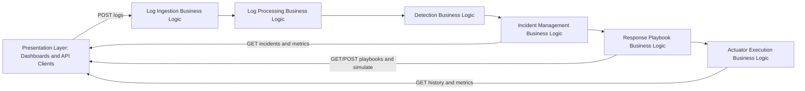

# Business Logic Layer Report (Lab Submission)

## Q1. Core Functional Modules in the Business Logic Layer and Their Interaction with the Presentation Layer

### 1) Core business logic modules implemented

The following modules form the core business logic of the project:

1. **Log Ingestion Module**
   - Files: `src/log_ingestion_service/processor.py`, `src/log_ingestion_service/models.py`
   - Responsibility:
     - Validates and normalizes incoming log payloads.
     - Generates `event_id` and ingestion timestamps.
     - Handles single and batch ingestion workflows.

2. **Log Processing Module**
   - Files: `src/log_processing_service/pipeline.py`, `src/log_processing_service/processors/*`
   - Responsibility:
     - Multi-stage pipeline: validation, normalization, noise filtering, enrichment, feature extraction.
     - Produces structured `ProcessedEvent` objects for downstream detection.

3. **Detection Module**
   - Files: `src/detection_service/pipeline.py`, `src/detection_service/rule_engine.py`, `src/detection_service/anomaly_engine.py`
   - Responsibility:
     - Rule-based detection (threshold and event-pattern rules).
     - Anomaly-based detection (z-score and rate-based anomaly checks).
     - Emits detection signals with confidence and incident context.

4. **Incident Management Module**
   - Files: `src/incident_management/incident_manager.py`, `src/incident_management/correlation_engine.py`, `src/incident_management/severity_engine.py`
   - Responsibility:
     - Correlates incoming signals to existing incidents using correlation keys + time windows.
     - Creates/updates incidents.
     - Computes and re-computes incident severity.
     - Tracks lifecycle transitions, timeline, assignment, and analyst notes.

5. **Response / Playbook Module**
   - Files: `src/response_service/engine/playbook_engine.py`, `src/response_service/repository/playbook_repository.py`, `src/response_service/actions/executor.py`
   - Responsibility:
     - Matches incident signal type to enabled playbooks.
     - Executes mapped response action with retries and timeout behavior.
     - Persists and exposes playbook configuration.

6. **Actuator Execution Module**
   - Files: `src/actuator_service/pipeline.py`, `src/actuator_service/executor/action_executor.py`
   - Responsibility:
     - Executes remediation actions in subprocess/docker/service-call modes.
     - Stores execution history and metrics.
     - Publishes execution result events.

---

### 2) Interaction with already implemented presentation layer

The project already includes presentation-layer components (HTML dashboards + REST APIs) that directly consume outputs from the business logic modules.

1. **Log Ingestion Dashboard/UI**
   - File: `src/log_ingestion_service/app.py` (embedded dashboard)
   - UI endpoints used:
     - `GET /ingestion/stats`
     - `GET /ingestion/recent-logs`
   - Business-layer interaction:
     - `processor.py` updates normalized log data and stats.
     - Dashboard polls and displays ingestion throughput, queue size, and latest logs.

2. **Incident Management Analyst Dashboard/UI**
   - Files: `src/incident_management/ui/dashboard.py`, `src/incident_management/api/incident_routes.py`
   - UI endpoints used:
     - `GET /incidents`, `GET /incidents/{id}`
     - `PATCH /incidents/{id}/status`
     - `POST /incidents/{id}/assign`, `POST /incidents/{id}/notes`
     - `GET /metrics`
   - Business-layer interaction:
     - IncidentManager + CorrelationEngine + SeverityEngine provide incident state.
     - UI updates analyst actions (status changes, assignment, notes), which flow back to business logic.

3. **Response Service Playbook Dashboard/UI**
   - Files: `src/response_service/ui/dashboard.py`, `src/response_service/api/app.py`
   - UI endpoints used:
     - `GET /playbooks`, `POST /playbooks`, `PUT /playbooks/{id}`
     - `PATCH /playbooks/{id}/toggle`, `DELETE /playbooks/{id}`
     - `POST /simulate`, `POST /simulate-response`
   - Business-layer interaction:
     - Playbook repository and playbook engine expose and execute policy logic.
     - UI allows viewing, creating, enabling/disabling, and testing playbooks.

4. **Actuator Monitoring Dashboard/UI**
   - Files: `src/actuator_service/ui/dashboard.py`, `src/actuator_service/api/app.py`
   - UI endpoints used:
     - `GET /api/dashboard-data`
     - `GET /metrics`, `GET /history`, `GET /actions`
   - Business-layer interaction:
     - ActionExecutor and actuator pipeline provide execution outcomes.
     - UI visualizes success/failure/timeouts and action history.

---

### 3) End-to-end interaction summary

This demonstrates that the presentation layer does not directly implement decisions; it consumes and triggers workflows from the business logic modules through explicit API contracts.

## Q2. Business Rules, Validation Logic, and Data Transformation

### A) Business rules implementation across modules

Business rules are implemented as configurable and code-based rule sets in multiple modules:

1. **Event classification rules (Log Processing Normalizer)**
   - File: `src/log_processing_service/processors/normalizer.py`
   - Examples:
     - `http.request` is classified by status code (`5xx => HIGH`, `4xx => MEDIUM`, etc.).
     - `db.query` is classified by duration (`>5000ms => HIGH`, `>1000ms => MEDIUM`).
     - Error log-level can force severity escalation to at least HIGH.

2. **Detection threshold rules (Rule Engine)**
   - Files: `src/detection_service/rule_engine.py`, `src/detection_service/rules/*.py`
   - Examples:
     - HTTP error spike rule triggers when 5xx events exceed threshold in a sliding window.
     - Latency rule triggers when latency is above configured threshold.
   - Rulebook-driven loading allows enabling/disabling rules without changing engine code.

3. **Anomaly rules (Anomaly Engine)**
   - File: `src/detection_service/anomaly_engine.py`
   - Examples:
     - Z-score based latency anomaly detection.
     - Error-rate and frequency anomalies using rolling buckets and baseline comparisons.

4. **Incident correlation and severity rules**
   - Files: `src/incident_management/correlation_engine.py`, `src/incident_management/severity_engine.py`, `src/incident_management/models/incident_model.py`
   - Examples:
     - Signals are grouped by correlation key (service + signal type + environment + region) within a time window.
     - Severity escalation based on risk score, critical services, and signal counts.
     - Lifecycle transitions restricted by defined `STATUS_TRANSITIONS` map.

5. **Playbook/action selection rules**
   - File: `src/response_service/engine/playbook_engine.py`
   - Examples:
     - Incident signal type must match an enabled playbook.
     - If no playbook exists, action status becomes `no_playbook`.

6. **Execution control rules (safety/reliability)**
   - Files: `src/response_service/actions/executor.py`, `src/actuator_service/executor/action_executor.py`
   - Examples:
     - Timeout protection for action execution.
     - Retry with exponential backoff.
     - Explicit `NO_HANDLER` status for unsupported actions.

### B) Validation logic in the application

Yes, validation logic is implemented across layers.

1. **Input schema validation via Pydantic models**
   - Ingestion: `LogEntry`, batch models (`src/log_ingestion_service/models.py`)
   - Processing pipeline output schema: `ProcessedEvent` (`src/log_processing_service/models/normalized_event.py`)
   - Incident API request models (`src/incident_management/api/incident_routes.py`)
   - Response API models (`src/response_service/api/app.py`)

2. **API-level validation and error responses**
   - Invalid JSON returns `400` in ingestion endpoints.
   - Invalid/empty batches rejected; oversized batches rejected with `413` (`MAX_BATCH_SIZE`).
   - Invalid incident status values or invalid status transitions return `400`.
   - Missing incidents return `404`.

3. **Business validation in pipelines**
   - Validator resolves dual-field formats and drops malformed events.
   - Required resolved fields (`service_name`, `log_level`, `event_type`) enforced before downstream processing.
   - Output is validated again against `ProcessedEvent` before publish.

4. **Repository-level consistency checks**
   - Response service prevents duplicate playbook signal type and enforces unique indexing behavior in storage.

Overall, validation happens early (request), mid-pipeline (structural/business checks), and before persistence/output.

### C) Data transformation from data layer to presentation layer

Data transformation is implemented systematically so UI receives display-ready, consistent structures.

1. **Raw log -> canonical event transformation**
   - Files: `src/log_ingestion_service/models.py`, `src/log_processing_service/processors/validator.py`
   - Field normalization handles aliases (`service/service_name`, `event/event_type`, `level/log_level`) and default values.

2. **Canonical event -> enriched analytical event**
   - Files: `src/log_processing_service/processors/normalizer.py`, `enricher.py`, `feature_extractor.py`
   - Transformations include:
     - Severity and normalized type assignment
     - Region/cluster/environment enrichment
     - Risk-score computation
     - Tag derivation
     - Feature vectors for detection

3. **Detection signal transformation**
   - Files: `src/detection_service/pipeline.py`, `src/detection_service/models/detection_signal.py`
   - Signal objects are enriched with event context, confidence, IDs, and metadata for incident management.

4. **Incident view-model transformation for UI consumption**
   - Files: `src/incident_management/models/incident_model.py`, `src/incident_management/api/incident_routes.py`
   - Raw correlated data is transformed into API payloads with incident summary, timeline entries, notes, actions, and filter-friendly fields.

5. **Repository serialization transformation (DB -> API)**
   - File: `src/response_service/repository/playbook_repository.py`
   - MongoDB-specific fields (`_id`, datetime objects) are transformed into API-friendly forms (`id`, ISO timestamps).

6. **Dashboard-oriented aggregation transformation**
   - Ingestion, incident, response, and actuator services expose transformed summary metrics for polling dashboards.
   - This minimizes UI-side computation and keeps presentation logic thin.

## Conclusion

The project implements a strong business-logic layer using modular pipelines and engines, while presentation components (dashboards and APIs) interact through clear service contracts. Business rules, validation logic, and data transformation are all explicitly implemented and distributed across ingestion, processing, detection, incident management, response, and actuator modules.
